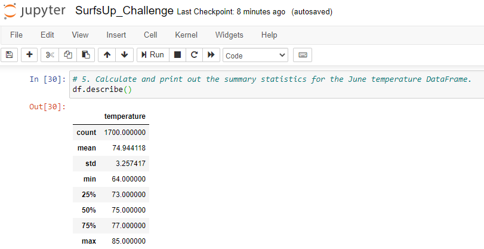
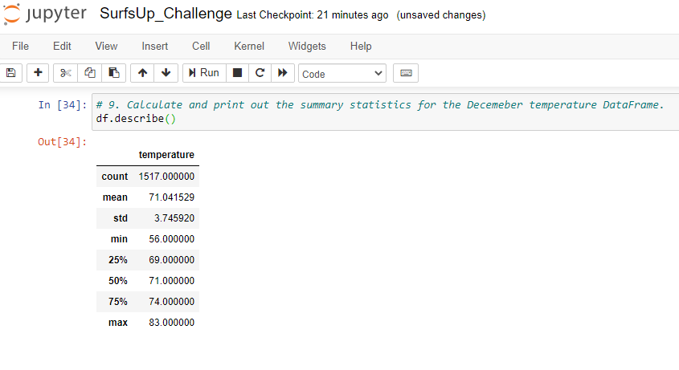

## Deliverable 3: A written report for the statistical analysis

1. **Overview of the analysis:** Using Python, Pandas functions and methods, and SQLAlchemy, we’ll filter the date column of the Measurements table in the `hawaii.sqlite` database to retrieve all the temperatures for the month of June. We'll then convert those temperatures to a list, create a DataFrame from the list, and generate the summary statistics. Once our dataframe is created we are able to get our summary statistics by using the `df.describe()` code and method. 
> Below our Analysis that what we found:

2. **Results:** Data Provided gave us a visibility that on months of June and December, our location had a total Temps of:

**June Temperatures - Analysis and Result**
* Count of 1700 
* Mean of 74.94 
* Std of 3.26 
* Min of 64.00 
* 25% of 73.00 
* 50% of 75.00
* 75% of 77.00
* Max of 85.00

**June Temperatures - Report**
> Image with `Jupyter Notebook` & `Python` Code below.

**December Temps - Analysis and Result**
* Count of 1517 
* Mean of 71.04 
* Std of 3.75
* Min of 56.00 
* 25% of 69.00 
* 50% of 71.00
* 75% of 74.00
* Max of 83.00

**December Temps - Report**
> Image with `Jupyter Notebook` & `Python` Code below.

3. **Summary:** Based on our Data Analysis, Data Provided, we can state as a high-level summary of results that Standard deviation is 3.25 in June and 3.75 in December, making a 0.5 difference between both seasons.
 
    In addition, the current data provides attributes like precipitation, with two queries that our analysis pursue, performing weather data for June and December that helps results to decide how we would like to build the shop and what areas would make this location popular for visitors to stop at and have a successful business model.